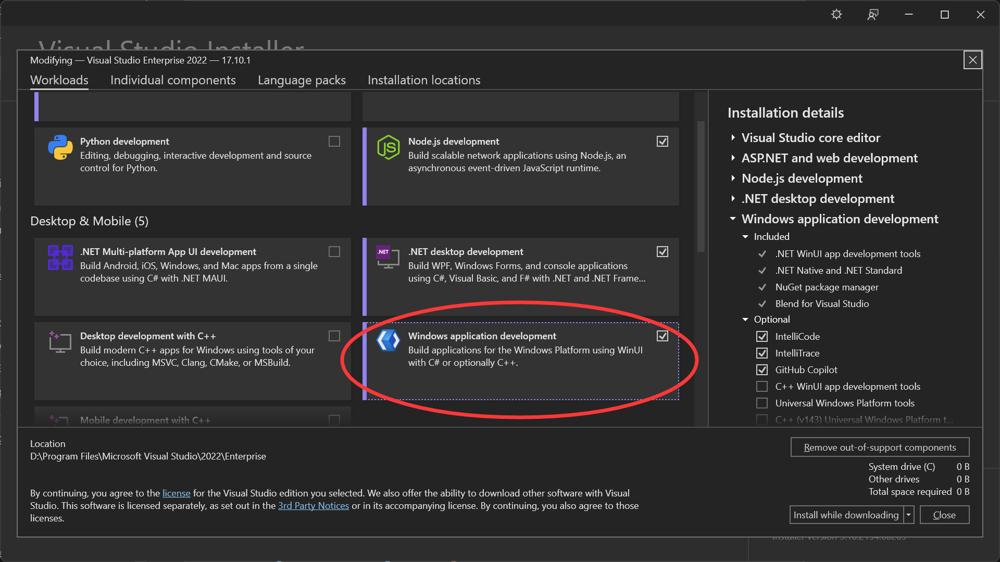

# Windows Application Development for NJUPT

This project is for the Windows Application Development course in NJUPT.

The course is aimed at **UWP** in 2024. Given how similar **WinUI3** and **UWP** are, I chose **WinUI3** for performance and development efficiency.

## Well, how to run this project ? 

First of all, you need a healthy PC with Windows（10 or newer） installed.

Be sure that you installed Visual Studio 2022 (17.10 or newer).

Open your Visual Studio Installer and be sure you have installed the crutial workload below.

Then you can clone this project and double-click the `.sln` file.

Just Debug / Run it. :D
